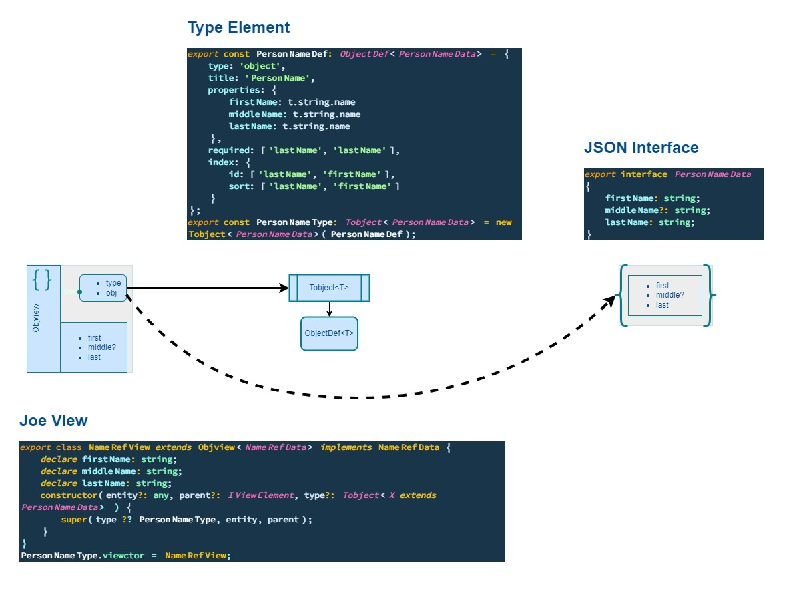

# JOE View Element

## Lexicon

> `View Element`: JOE class that behave like a typed `proxy` (under steroid) over a `JSON` element.
>

## View Element Design


A `View Element` is a `Generic` class whose role is to be a `View of T`.

A `JOE View` relies on 3 definitions :

1. A `Static Type` definition aka **typescript interface**,
2. An `Element Type` that rules the `Type` behaviours at runtime:

    - `Type` validation,
    - `Type` metadata enhancement,
    - `View` instanciation.
  
3. An `Element View` that extends your **typescript interface** as a `View<T>` class
    - It enforce all edition features your need,
    - It is a place holder for custom code

To avoid naming collision with your code all `JOE` property or function names on an `Element View` are prefix by a `$`.

- _Just one exception to this rule_: the `validate` method has no `$` prefix.

## View Element Construtor

```typescript

constructor(entity?: any, parent?: IViewElement, type?: Tobject<X extends T> ) {
   ...
}
```
You retrieve in the `View Element` `Contructor` all the here above core definitions:

- The `JSON instance`  implementing `T`:  
  - It is today declare as `any` and not `Partial<T>` because `Partial<T>` doesn't allow Partial<?> all along the hierarchy,
- The `Element Type` that enforce **T** `Type` behaviour,
- An optional parent `View Element` as the current `View Element` may be the inner element of an hierarchical `Type Model`.

Those 3 instances are the core elements of an `View element` architecture.


A `View Element` exposes two inner object instance:

- A `Validation Context` that is its validation state,

- An `Editor` that is assigned when the `View Element` is editing

  - $isEditing property is nothing else the `return this._editor !== undefined;`


### As diagram worth 1000 lines of text:




 [__Next...__](./joe-domain-model.html)