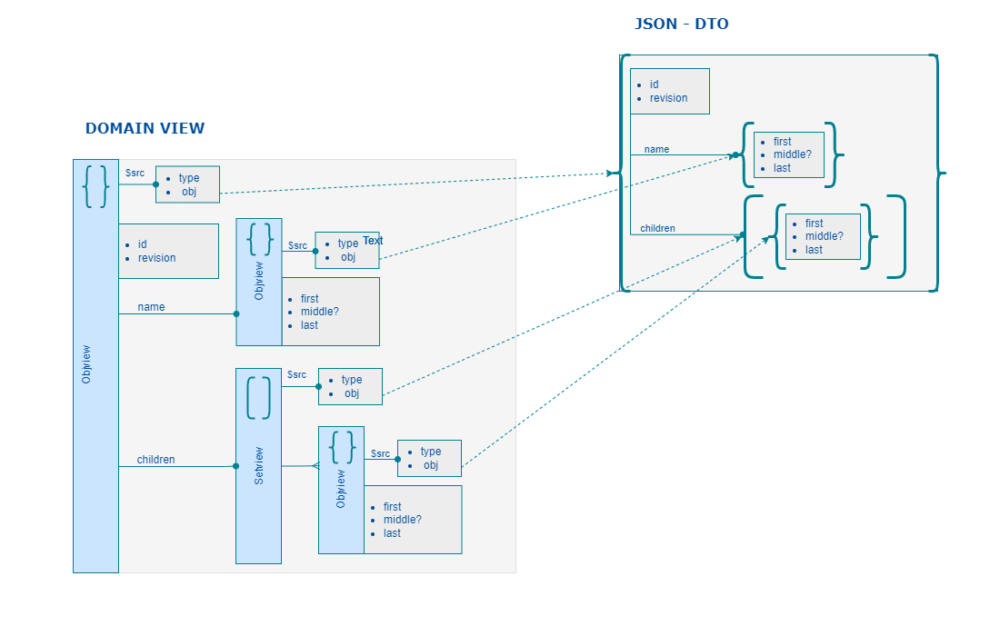

# JOE Domain Model

A `Domain Model` is supposed to be an hierarchy of `View Element` describing a `Business Concept`.
  - On simple case a `Domain Model` can rely on a single `View Element`.

  - The `Root Element` is either an Object or an Array or a Map.


Modeling `Domain Model` is a list of Type definitions relying on 3 declaration :

1- the typescript Data interface,
2- the Type Element relative to this interface
  - It is just an instance of Type definition that is very close from a JsonSchemas,
3- the Joe View class declaration. 

## Domain Model example



## Typescript code of Domain Model example
```typescript
import {IViewElement, ObjectDef, Objview, Setview, Tarray, Tobject} from "joe-fx";
import {t} from "joe-types";

/* ----------------------------------------------- 
 *                PersonName (Domain Element)
 * ----------------------------------------------- */

export interface PersonNameData {
    firstName: string;
    middleName?: string;
    lastName: string;
}


export const PersonNameDef: ObjectDef<PersonNameData> = {
    type: 'object',
    title: 'PersonName',
    properties: {
        firstName: t.string.name,
        middleName: t.string.name,
        lastName: t.string.name
    },
    required: ['lastName', 'lastName'],
    index: {
        id: ['lastName', 'firstName'],
        sort: ['lastName', 'firstName']
    }
};
export const PersonNameType: Tobject<PersonNameData> = new Tobject<PersonNameData>(PersonNameDef);
export const PersonNameListType: TArray<PersonNameType> = new Tarray<PersonNameData>(PersonNameType);

export class PersonNameView extends Objview<PersonNameData> implements NameRefData {
    declare firstName: string;
    declare middleName: string;
    declare lastName: string;
    constructor(entity?: any, parent?: IViewElement, type?: Tobject<X extends PersonNameData> ) {
        super(type ?? PersonNameType, entity, parent);
    }
}
PersonNameType.viewctor = PersonNameView;

/* ----------------------------------------------- 
 *                PersonDoc (Domain Model)
 * ----------------------------------------------- */
export interface PersonDocData {
    id: string;
    revision: string;
    name: PersonNameData;
    children: PersonNameData[];
}


export const PersonDocDef: ObjectDef<PersonDocData> = {
    type: 'object',
    title: 'PersonDoc',
    properties: {
        id: t.string.id,
        revision: t.string.word,
        name: PersonNameType,
    },
    required: ['id', 'revision', 'name'],
    index: {
        id: 'id',
        rev: 'revision'
        sort: ['name>lastName', 'name>firstName']
    }
};
export const PersonDocType: Tobject<PersonDocData> = new Tobject<PersonDocData>(PersonDocDef);

export class PersonDocView extends Objview<PersonDocData> implements PersonDocData {
    declare id: string;
    declare revison: string;
    declare name: PersonNameView;
    declare children: Setview<PersonNameView>;
    constructor(entity?: any, parent?: IViewElement, type?: Tobject<X extends PersonNameData> ) {
        super(type ?? PersonDocType, entity, parent);
    }
}
PersonNameType.viewctor = PersonDocView;
```

 [__Next...__](./joe-types.html)